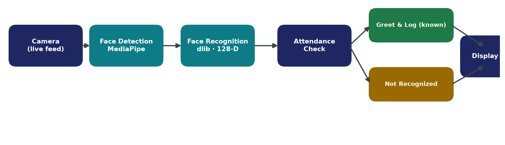
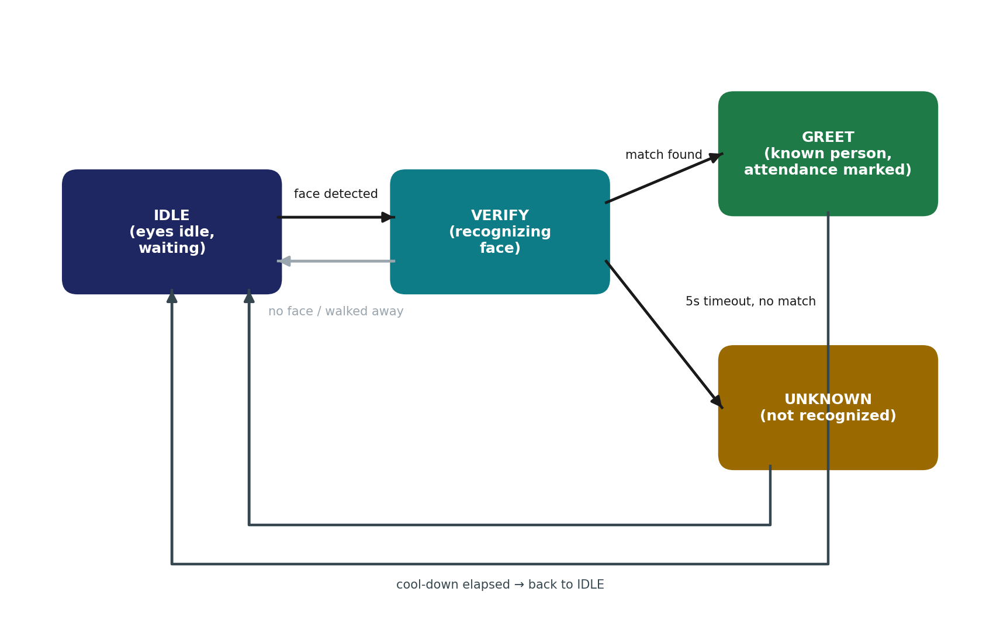
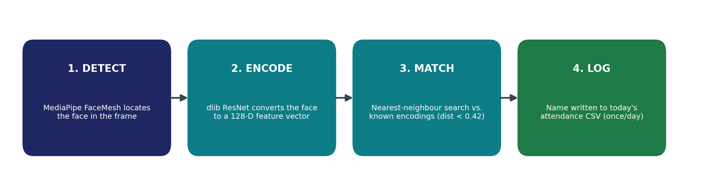

<div align="center">

# Face-Recognition Attendance Kiosk

**An offline, self-serve attendance station built on a Raspberry Pi 5 — it recognizes a face, greets the person with animated eyes, and logs their attendance. No cards, no app, no internet.**

[](https://www.python.org/)
[](https://www.raspberrypi.com/)
[](https://opencv.org/)
[](https://developers.google.com/mediapipe)
[](https://www.pygame.org/)

[](LICENSE)



</div>

Developed as part of **Beyond Curriculum Training (BCT) in Robotics** at Narula Institute of Technology, Department of Electronics and Communication Engineering.

## Features

- **Real-time face recognition** — MediaPipe face detection + dlib 128-D encodings, matched by nearest neighbour (threshold 0.42)
- **Animated kiosk UI** — cyan eyes that track the visitor's face, blink, and change expression per state
- **Personalized greeting** — photo, name, role, and attendance status the moment someone is recognized
- **One entry per person per day** — a second sighting shows "already marked", never a duplicate row
- **On-kiosk enrollment** — press `E`, type a name, look at the camera; saved and matched instantly
- **Hot reload** — press `R` to rescan the face database in the background, no restart
- **Fully offline & private** — every stage runs on the Pi; no face data ever leaves the device
- **Restart-safe daily logs** — plain CSV per day; resumes today's sheet after a reboot, rolls over at midnight

## Screenshots

| Recognized — greeting + attendance marked | Already marked (second sighting) |
|:--:|:--:|
|  |  |

## How it works

The kiosk runs a four-state loop:



Recognition itself is a four-step pipeline, running on a background thread so the UI never freezes:



Three threads cooperate: a camera grabber that always holds the latest frame, a recognition worker that attempts a match 4× per second, and the main pygame loop drawing the eyes and screens at 30 FPS.

## Hardware

| Item | Notes |
|---|---|
| Raspberry Pi 5 (8 GB) | Runs the whole pipeline on-device |
| Camera module / USB webcam | 640×480 live feed |
| HDMI display or touchscreen | Fullscreen kiosk UI |
| microSD 32 GB+, 5V/5A USB-C supply | Raspberry Pi OS (Bookworm, 64-bit) |

## Installation

```bash
git clone <this-repo>
cd <repo-folder>
./setup_bot.sh        # installs system deps, creates venv, installs Python libs
```

> `face_recognition` compiles dlib on the Pi — expect 15–20 minutes on first install.

Or manually:

```bash
sudo apt install libopencv-dev libatlas-base-dev libhdf5-dev cmake gfortran libopenblas-dev liblapack-dev
python3 -m venv biometric_env
source biometric_env/bin/activate
pip install -r requirements.txt
```

## Adding people to the face database

Photos live in `known_faces/`, organized by group folder (the group name becomes the person's *category* in the log):

```
known_faces/
├── Students/
│   ├── Priya Sharma.jpg          # flat file: name = filename
│   └── Arjun Mehta/              # or a per-person folder
│       ├── Arjun Mehta.jpg
│       └── Arjun Mehta.txt       # optional details shown on the greeting screen
└── Signass Student/
    └── ...
```

- Only groups listed in `ENABLED_GROUPS` (`config.py`) are loaded
- Phone photos work — EXIF rotation is handled automatically
- After adding photos, press `R` on the kiosk (or restart) to load them

*Face photos are deliberately excluded from this repository — see [`known_faces/README.md`](known_faces/README.md).*

## Running

```bash
cd <repo-folder>
source biometric_env/bin/activate
python main.py
```

Run it on the Pi's own display. Over SSH, add `export DISPLAY=:0` first. For auto-start on boot, `run_bot.sh` waits for the desktop, activates the venv, and restarts the kiosk if it ever exits.

### Hotkeys

| Key | Action |
|---|---|
| `E` | Enroll the person in front of the camera |
| `R` | Hot-reload the face database |
| `D` / tap | Toggle debug view (camera, face mesh, FPS, match distance) |
| `Q` / `Esc` | Quit |

## Attendance output

One CSV per day in `attendance/` (e.g. `attendance/2026-07-17.csv`):

| Name | Category | Time |
|---|---|---|
| Anirudha Sarkar | Signass Student | 07:30 AM |
| Aditya Talukdar | Students | 07:42 AM |

## Project structure

| File | Responsibility |
|---|---|
| `main.py` | State machine and orchestration |
| `bot_vision.py` | Camera thread, face tracking, recognition worker, enrollment |
| `bot_eyes.py` | pygame UI — animated eyes, greeting screens, overlays |
| `bot_attendance.py` | Daily CSV logging with de-duplication |
| `config.py` | All tunable settings (threshold, timings, groups, colours) |

## Documentation

- 📄 [Project report](docs/Project_Final_Report.pdf) ([.docx](docs/Project_Final_Report.docx)) — full write-up: analysis, design, implementation, testing, results
- 📊 [Presentation](docs/Face_Attendance_Kiosk.pdf) ([.pptx](docs/Face_Attendance_Kiosk.pptx)) — 14-slide project deck

## Roadmap

- Export / sync attendance to Google Sheets
- Multi-face handling for busy entrances
- Liveness check to resist photo spoofing
- Lightweight web dashboard for live monitoring

## License

[MIT](LICENSE)
